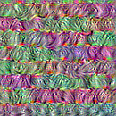
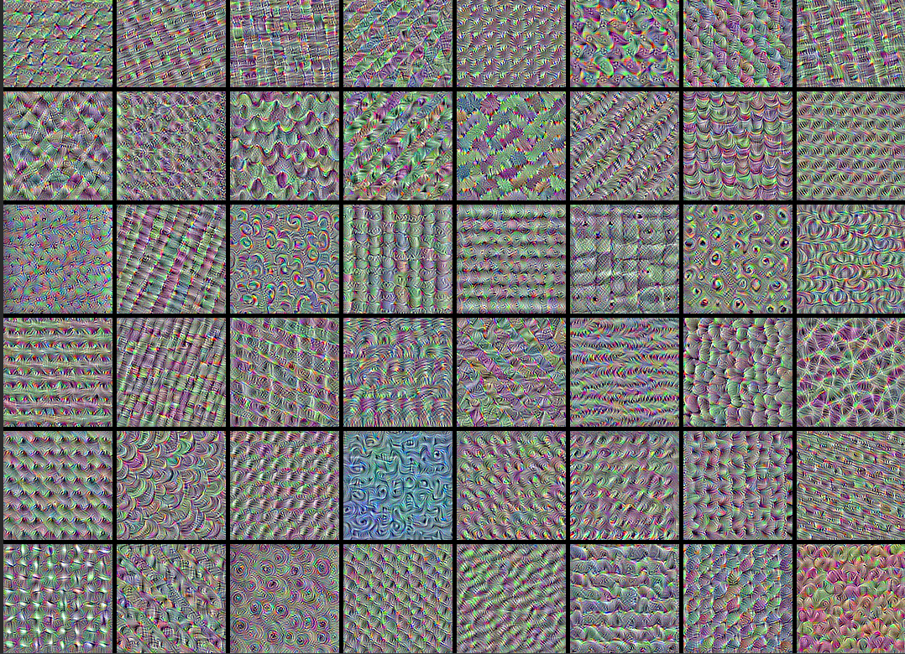

# ConvNets Feature Maps Visualization

## Introduction
In this example, I look into what sort of visual patterns image classification models learn. I used ResNet50V2 model, trained on the ImageNet dataset.

 

## Steps
1. Build a feature extraction model (ResNet50V2)

2. Compute loss and Set up the gradient ascent process

3. Set up the end-to-end filter visualization loop:
    - Start from a random image that is close to "all gray"
    - Repeatedly apply the gradient ascent step function defined above
    - Convert the resulting input image back to a displayable form, by normalizing it, center-cropping it, and restricting it to the [0, 255] range. Example:  

4. Visualize the first 64 filters in the target layer (8x8 grid): 

 

## Usage
You can run the code by runing the __ConvNets_Feature_maps_and_Filters.ipynb__ or __convnets_feature_maps_and_filters.py__ file, and you can change the visualization layer or use a different datasets.
